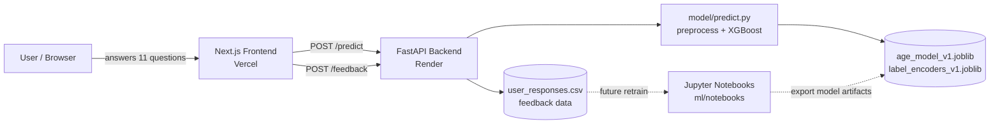
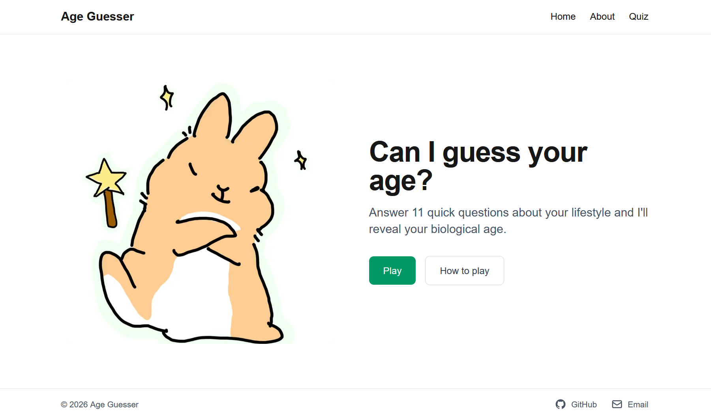
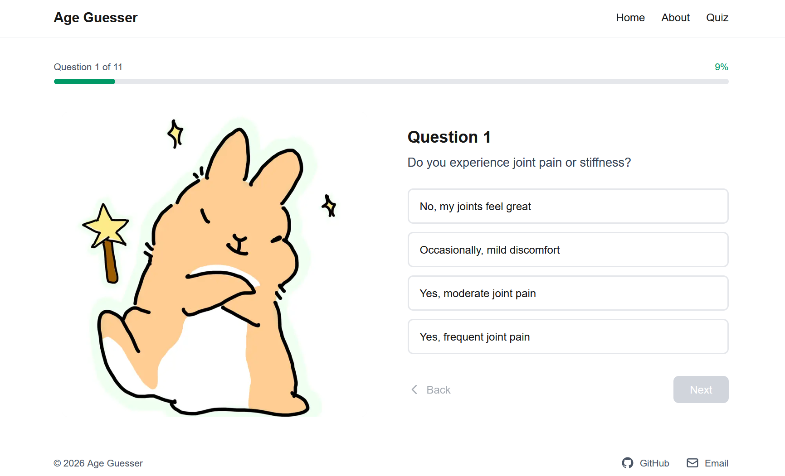
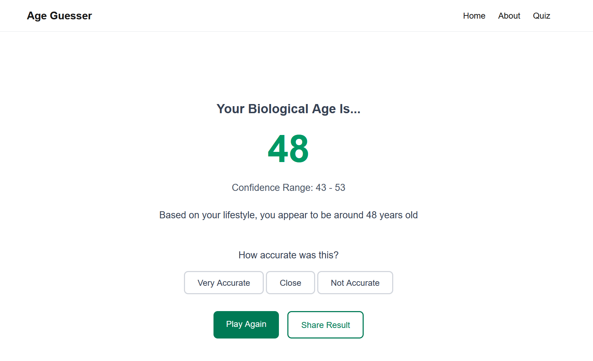
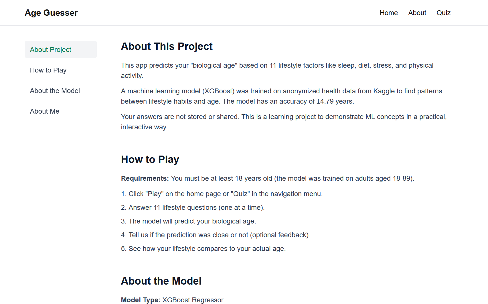

# 🎂 Age Guesser — Full-Stack ML Web App

> **"Can I guess your age?"** — Answer 11 fun questions about your lifestyle (sleep, diet, stress, smoking and more) and a trained machine learning model estimates your **biological age**.

A complete full-stack project that takes a model from **raw data → training → REST API → interactive web UI**, deployed with a **CI/CD pipeline**.

[](https://www.typescriptlang.org)
[](https://nextjs.org)
[](https://react.dev)
[](https://tailwindcss.com)
[](https://fastapi.tiangolo.com)
[](https://www.python.org)
[](https://xgboost.readthedocs.io)
[](https://scikit-learn.org)
[](https://github.com/features/actions)
[](https://vercel.com)
[](https://render.com)

[](https://github.com/suselyt/age_prediction/actions)
[](https://github.com/suselyt/age_prediction/actions)
[](LICENSE)

---

## 📖 Overview & Features

Age Guesser turns a tabular ML regression problem into a web app quiz. Users answer a step-by-step questionnaire about their lifestyle and instantly get back a predicted age with a confidence range — then they can tell the app how accurate the prediction was, feeding **real user data back** into the ML loop.

### ✨ Features

- **11-question interactive quiz** — one question at a time, with a live progress bar and back/next navigation.
- **Real ML predictions** — answers are sent to a FastAPI backend that runs a trained **XGBoost regressor** (MAE **4.79 years**, R² **0.909**).
- **Confidence range** — every prediction returns a plausible age range, not just a single number.
- **User feedback loop** — "Very Accurate / Close / Not Accurate" buttons plus a modal to input your real age; feedback is saved to a CSV for future model retraining.
- **Share results** — one-click copy of a shareable result link.
- **Responsive UI** — mobile-first layout with a hamburger nav, hero landing page, About page with scroll-spy sidebar, and emerald-themed design.
- **Auto-generated API docs** — FastAPI serves interactive `/docs` and `/redoc`.
- **CI/CD out of the box** — linting, type checking, builds, model validation and auto-deployment all automated via GitHub Actions.

---

## 🧠 System Architecture



```
age_prediction/
│
├── frontend/                    # Next.js 16 (App Router) + TypeScript + Tailwind
│   ├── app/
│   │   ├── page.tsx             # Landing page
│   │   ├── quiz/page.tsx        # Step-by-step 11-question quiz
│   │   ├── result/page.tsx      # Prediction result + feedback flow
│   │   └── about/page.tsx       # About / model / disclaimer
│   ├── components/              # Header, Footer, FeedbackFlow, AgeInputModal
│   ├── lib/                     # api.ts (fetch wrapper), questions.ts
│   └── types/quiz.ts            # Shared TypeScript interfaces
│
├── backend/                     # FastAPI REST API
│   ├── main.py                  # App entry + CORS + routes
│   ├── schemas.py               # Pydantic input/output validation
│   ├── feedback_logic.py        # CSV feedback persistence
│   └── model/predict.py         # Loads artifacts + inference logic
│
├── ml/                          # ML pipeline (standalone)
│   ├── notebooks/               # 01_train_model.ipynb, 02_export_model.ipynb
│   ├── models/                  # age_model_v1.joblib, label_encoders_v1.joblib,
│   │                            # model_metadata_v1.json
│   └── data/                    # Datasets (Kaggle + wellbeing)
│
├── data/feedback/               # user_responses.csv (feedback collection)
└── .github/workflows/           # backend-ci.yml, frontend-ci.yml, deploy.yml
```

---

## 🤖 The Machine Learning Model

- **Task**: regression — predict chronological age (18–89) from 11 lifestyle features.
- **Algorithm**: XGBoost Regressor (`n_estimators=200`, `learning_rate=0.1`, `max_depth=6`).
- **Dataset**: [Kaggle — Human Age Prediction](https://www.kaggle.com/datasets/abdullah0a/human-age-prediction-dataset).

### Pipeline

```
Raw input → Ordinal encoding (activity, alcohol, mental health, income)
         → Label encoding (smoking, diet, sleep)
         → XGBoost Regressor → Predicted Age
```

### Performance

| Metric | Value | Target | Status |
|---|---|---|---|
| **MAE** | 4.79 years | < 8 years | ✅ |
| **R²** | 0.909 | — | — |

MAE by age group: Young (18–30) **3.49** · Middle (31–45) **5.40** · Senior (46–60) **5.59** · Elder (61+) **4.52**

### The 11 Features

Bone density, vision sharpness, hearing ability, physical activity, smoking status, alcohol consumption, diet, mental health, sleep patterns, stress levels, income level.

### Incremental Learning

Every piece of user feedback (including their real age) is appended to `data/feedback/user_responses.csv` — the foundation for periodic model retraining with real-world data.

---

## 📸 Screenshots


| Landing page | Quiz |
|---|---|
|  |  |

| Result page | About |
|---|---|
|  |  |

---

## ✅ Requirements

- **Node.js** 18+ and npm
- **Python** 3.10+
- A package manager for Python (recommended: `venv` + `pip`)

---

## 🚀 Installation & Running Locally

### 1. Clone & install backend

```bash
git clone https://github.com/suselyt/age_prediction.git
cd age_prediction/backend

python -m venv .venv
.venv\Scripts\activate        # Windows
source .venv/bin/activate      # macOS / Linux

pip install -r requirements.txt
uvicorn main:app --reload
```

The API now runs at **http://127.0.0.1:8000** — try the interactive docs at **http://127.0.0.1:8000/docs**.

### 2. Install & run frontend

```bash
cd ../frontend
npm install

# point the frontend at your local backend
# create .env.local with:
NEXT_PUBLIC_API_URL=http://127.0.0.1:8000

npm run dev
```

Open **http://localhost:3000**, click **Play**, and answer the 11 questions.

### 3. (Optional) Retrain the model

```bash
cd ../ml
pip install -r requirements-dev.txt
jupyter notebook notebooks/01_train_model.ipynb
```

---

## API Reference

### `POST /predict`

Sends lifestyle answers, returns a predicted age.

```jsonc
// Request
{ "bone_density": 0.95, "vision_sharpness": 75, "hearing_ability": 25,
  "physical_activity_level": "Moderate", "smoking_status": "Non-smoker",
  "alcohol_consumption": "Occasional", "diet": "Omnivore",
  "mental_health_status": "Good", "sleep_patterns": "Normal",
  "stress_levels": 6, "income_level": "Medium" }

// Response
{ "predicted_age": 38, "confidence_range": "33 - 43",
  "message": "Based on your lifestyle, you appear to be around 38 years old" }
```

### `POST /feedback`

Records how accurate the prediction was (`very_accurate` | `close` | `not_accurate`), storing it for retraining. `actual_age` is required unless the prediction was `very_accurate`.

---

## 🎓 What I Learned

This project was built to learn real ML + full-stack engineering end to end:

- **End-to-end ML integration** — turning a Jupyter notebook experiment into a serialized model (`joblib`) with metadata, served through a live REST API with identical preprocessing on both sides (training vs. inference).
- **FastAPI & Pydantic v2** — request/response schemas with validation, `@model_validator` for cross-field rules, and automatically generated interactive docs.
- **REST API design** — two clean endpoints (`/predict`, `/feedback`), CORS configuration, and a feedback loop that persists real user data for future retraining.
- **React 19 + Next.js internals** — fixed an **infinite re-render loop** caused by `useSearchParams` returning new object references; wrapping client components in a **`Suspense` boundary** (required for the production build), and taming Strict Mode's double-invoked effects in dev.
- **Component composition & state** — prop-driven parent/child components (`FeedbackFlow`, `AgeInputModal`), lifting state up, and TypeScript **type narrowing** with conditional rendering.
- **CI/CD with GitHub Actions** — YAML workflows for backend linting (Ruff) + model validation + smoke tests, frontend lint/typecheck/build, and auto-deployment triggered on merge to `main` via a **Render deploy hook**.
- **Deployment** — free-tier Vercel (frontend) + Render (backend), env-var alignment between `.env.local` and the API client.
- **Tooling hygiene** — ESLint, `tsc --noEmit`, Ruff with a `pyproject.toml`, and branch protection with required status checks.

---

## 🏆 Portfolio Highlight

Age Guesser demonstrates the **complete software lifecycle of a machine learning product** — not just a notebook:

- **ML proficiency**: model training, feature encoding (ordinal + label), evaluation (MAE, R²), and serialization for production.
- **Full-stack engineering**: a polished Next.js UI wired to a validated FastAPI backend.
- **Product thinking**: an interactive feedback loop that collects real user data to keep the model improving.
- **DevOps mindset**: automated CI/CD, linting, type safety and deployment — production-ready from day one.

---

## 👤 Author

**Susely Trejo** 

[](https://github.com/suselyt)
[](mailto:susely.dev@gmail.com)

---

## 📄 License

Distributed under the **MIT License**. See [`LICENSE`](LICENSE) for more information.

---

> **Disclaimer:** For educational and entertainment purposes only. Predictions are statistical estimates, not medical advice.